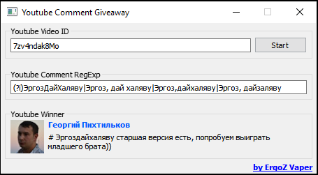

# Youtube Comment GiveAway
Application to make a Giveaway by comments under Youtube video

Приложение для проведения розыгрышей/раздач на основании комментариев под видео на Youtube с возможностью использования фильтров.

# Dependecies / Зависимости

Go packages:

 - gopkg.in/qml.v1
 - gopkg.in/qml.v1/cmd/genqrc
 - github.com/parnurzeal/gorequest
 - gopkg.in/yaml.v2
 
System requirements:

 - Ant
 - QT 5.4.1
 - MinGW x64
   - libstdc++-6
   - libgcc_s_seh-1
 
# How to build / Как собрать

 - Add `GODEBUG` param with `cgocheck=0` value to system environment
 - Run `ant` in project root directory
 - After compile edit your youtube api key in `config.yml` file

#How to run / Как запускать
You should use `run.bat` to start this application.

#ToDo

- [x] Getting youtube video comments
- [x] Getting random comment
- [x] Create GUI
- [ ] Improve GUI